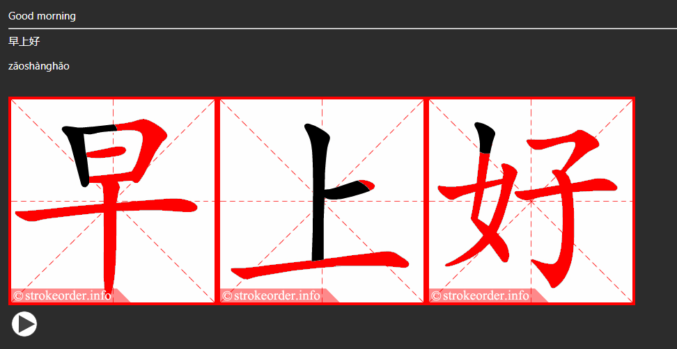

# chinese-anki-gen

Generate Anki Deck from chinese audio files. 

Example Card:



Steps in the script:
1. Get the chinese character by whisper model
2. get pinyin 
3. get translation to target language
4. get stroke order gifs for each character of the word
5. pack everything into a flashcard
6. export deck of vocabulary including the all cards

The input requires a single audio file per word. You can split audio files by words e.g. with [mp3split](https://wiki.ubuntuusers.de/mp3splt/)

```sh
mp3splt -s -d $targetDir -p th=-54,shots=10 $FileName
```

Make manual overwrites where needed to either the chinese character, pinyin, or translation by setting the overwrite dicitionary with the file name for which you want to override as key. 

```python
# use these chinese chars instead of the result from text2speech model
overwrite_char = {
    "input/file_1.mp3" : "日本",
    "input/file_2.mp3" : "人",
}
```

